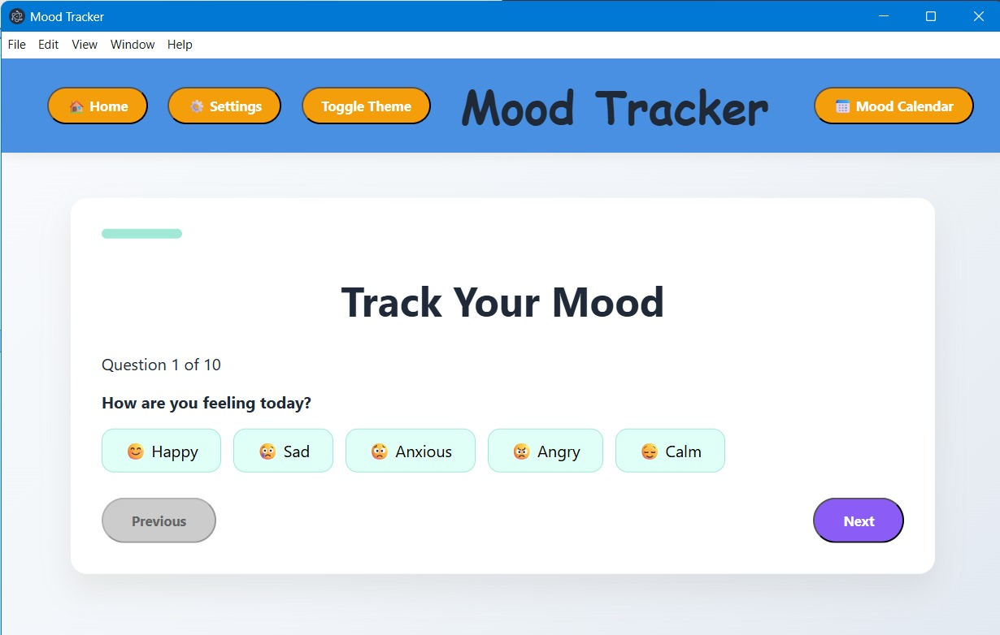
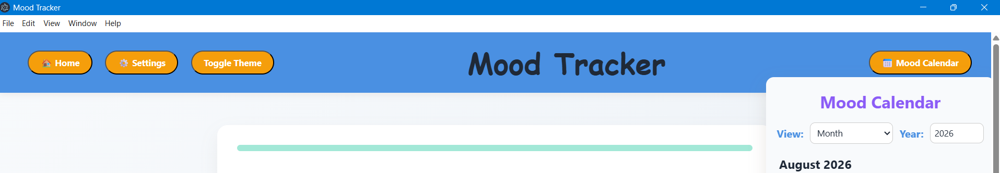
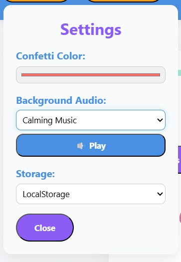
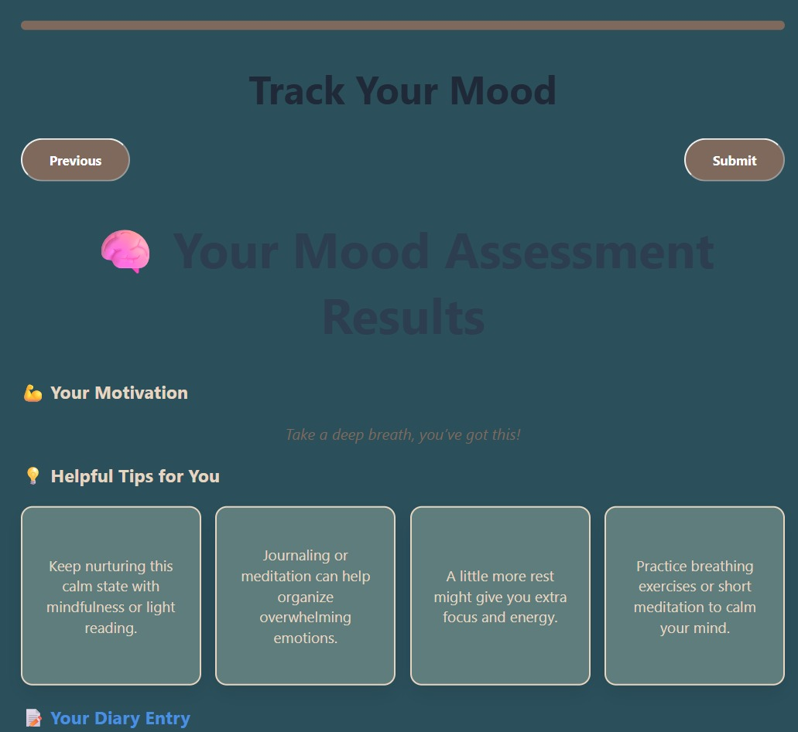
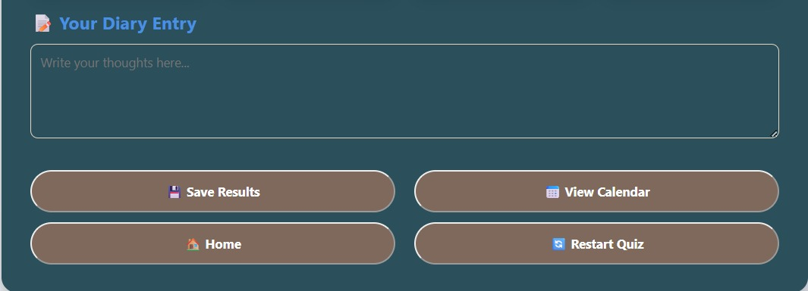

# Mood Tracker Desktop 🌤️

A desktop mood-tracking application built with **Electron**, vanilla HTML/CSS/JavaScript, and a custom XML-based rule engine. The app provides a short daily check-in, generates personalized tips and motivation based on the user's responses, and maintains a visual mood history through a calendar.

Everything runs locally — **no server, account, or external backend is required.**

> **Project status:** Personal/academic project

## Screenshots

### Daily Check-in



### Mood Calendar



### Settings



### Personalized Results



### Diary Entry



## Features

* 📝 **10-question daily check-in** covering mood, sleep, stress, energy, focus, social interaction, appetite, exercise, time outdoors, and overall balance
* 💡 **Rule-based personalization** using an XML ruleset to generate relevant tips, motivation, and diary prompts
* 📅 **Mood calendar** with monthly and yearly views of previous check-ins
* 🔎 **Daily history review** to revisit saved check-ins and generated recommendations
* 🎨 **Light and dark themes** with animated transitions
* 🎵 **Background audio** with calming music, meditation, and nature sounds
* 🎉 **Confetti celebration** with a customizable confetti color
* 💾 **Local data persistence** with a choice between `localStorage` and `sessionStorage`
* ♿ **Accessibility support** including keyboard navigation and visible focus states
* 🔒 **Offline-first design** with no external backend or user account
* 🖥️ **Windows desktop packaging** using Electron Forge

## How It Works

1. The user answers the 10 daily questions.
2. The application evaluates the responses against rules defined in `mood-rules.xml`, loaded at runtime via `DOMParser`. If the file can't be read or parsed, it falls back to an equivalent ruleset embedded in `script.js`.
3. Matching rules produce personalized **tips**, a **motivational message**, and a **diary prompt** (e.g. `IF mood = anxious THEN provide an anxiety-related tip`), keeping the personalization logic separate from the interface code and easy to modify.
4. The most relevant results are shown after the check-in and saved locally.
5. Saved entries appear on the mood calendar and can be reviewed later.

## Privacy

Mood data is stored locally using browser-based web storage — the app requires no account, server, database, or external API, and no internet connection for its core functionality. Your check-in history stays on your own device.

## Tech Stack

* **Desktop Framework:** Electron 38
* **Frontend:** HTML5, CSS3, Vanilla JavaScript
* **Rules Engine:** Custom RuleML-style XML ruleset
* **XML Parsing:** `DOMParser`
* **Local Storage:** `localStorage` / `sessionStorage`
* **Desktop Packaging:** Electron Forge
* **Windows Installer:** Squirrel
* **Additional Packaging:** ZIP, Debian, and RPM makers configured through Electron Forge

## Project Structure

```text
mood-tracker-desktop/
├── electron.js                  # Electron main process
├── package.json                 # Project metadata and Electron Forge configuration
├── .gitignore                   # Git ignore rules
│
├── screenshots/
│   ├── check-in.jpeg            # Daily check-in interface
│   ├── calendar.png             # Mood calendar
│   ├── settings.jpeg            # Application settings
│   ├── results.jpeg             # Personalized results
│   └── diary-entry.jpeg         # Diary entry interface
│
└── src/
    ├── index_new.html           # Main application window
    ├── script.js                # Application logic
    ├── mood-rules.xml           # XML personalization rules
    ├── base.css                 # Reset, utilities, and shared animations
    ├── theme.css                # Light/dark theme variables and styling
    ├── components_new.css       # Component-level styles
    ├── style.css                # Additional styling and transitions
    ├── calming-music.mp3        # Calming background audio
    ├── meditation.mp3           # Meditation background audio
    └── nature-sounds.mp3        # Nature sounds background audio
```

## Installation & Usage

### Option A — Download the packaged application

For users who only want to run the application, download the latest Windows installer from the repository's **Releases** page.

1. Open the [Releases](../../releases) section.
2. Download the latest Windows installer.
3. Run the installer.
4. Launch **Mood Tracker Desktop**.

No Node.js installation is required when using the packaged application.

### Option B — Run from Source

For development or testing, make sure the following are installed:

* [Node.js](https://nodejs.org/) 18 or later
* npm

Clone the repository and install the dependencies:

```bash
git clone <YOUR_REPOSITORY_URL>
cd mood-tracker-desktop
npm install
```

Start the application:

```bash
npm start
```

This launches the Electron application in development mode.

### Build the Application

To generate an unpacked application build:

```bash
npm run package
```

To generate distributable installers:

```bash
npm run make
```

Electron Forge places generated build artifacts inside the `out/` directory. Depending on the configured makers, the output may include a Windows installer and ZIP package.

## Development Notes

The Electron main process loads `src/index_new.html`. The renderer uses Node's `fs` and `path` modules to load the XML ruleset directly from the local filesystem, which requires the current configuration:

```text
nodeIntegration: true
contextIsolation: false
```

This is acceptable for a fully local application like this one, but should be reconsidered — e.g. moved to a preload-script architecture — if the app ever loads remote content, external pages, or third-party integrations.

For production builds, also disable dev tools by removing or commenting out:

```javascript
win.webContents.openDevTools();
```

## Data Storage

The application supports two browser storage mechanisms, selectable from Settings:

* **`localStorage`** — check-in history persists after closing and reopening the application.
* **`sessionStorage`** — check-in history is available during the current session only, and clears when the session ends.

## Accessibility

Accessibility has been considered throughout the interface, including:

* Keyboard navigation
* Visible focus outlines
* Interactive controls that can be reached without a mouse
* Theme support for different visual preferences
* Clear interface states and feedback

## Known Issues

* **Content Security Policy and Google Fonts** — the app references a Google Fonts stylesheet, but the CSP doesn't explicitly permit the corresponding external stylesheet/font domains. Fix by adding the required domains to the CSP, or by bundling the font locally.
* **Duplicate Calendar Markup** — `index_new.html` currently contains duplicate calendar-related markup, including more than one `mood-calendar-panel`/calendar container. The unused markup should be removed to prevent duplicate-ID and DOM-selection issues.

## Future Improvements

* Migrating filesystem access to a safer Electron preload architecture
* Adding more sophisticated rule combinations
* Adding mood and wellness trend visualizations
* Exporting mood history as CSV or JSON
* Adding optional encrypted local storage
* Adding customizable check-in questions
* Adding more themes and accessibility options
* Improving the calendar with mood-based visual indicators
* Adding automated tests for the rule engine
* Creating signed production installers
* Adding cross-platform release builds

## Build Output

Generated Electron Forge artifacts are stored in `out/`. 

